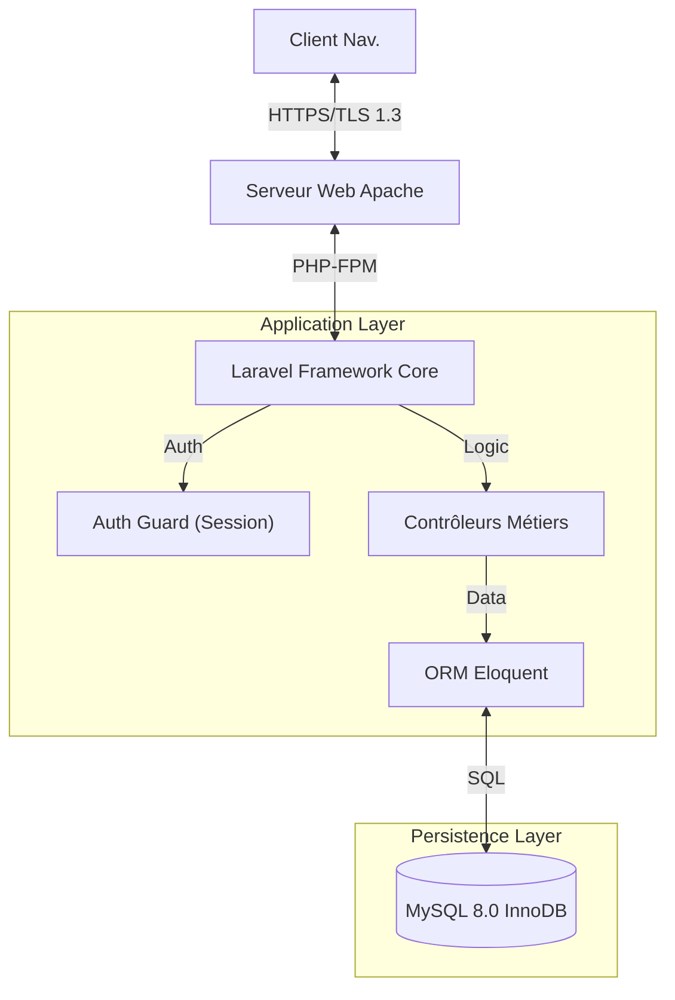

# 📑 RAPPORT DE SOUTENANCE TECHNIQUE : DC-MANAGER v2.0

**MÉMOIRE TECHNIQUE DE RÉALISATION**

| Informations Projet | Détails |
| :--- | :--- |
| **Intitulé du Projet** | Conception et Développement d'une Plateforme d'Orchestration de Ressources Data Center |
| **Code Projet** | `IDAI-2026-DCM` |
| **Auteur** | **Homam Dany** (Étudiant Ingénieur) |
| **Filière** | Ingénierie de Développement d'Applications Informatiques (IDAI) |
| **Établissement** | Faculté des Sciences et Techniques (FST), Tanger |
| **Version** | 2.1.0 (Build Production - "Pro Edition") |
| **Date de remise** | Février 2026 |

---

## 📄 SOMMAIRE

1.  [Résumé Exécutif](#1-résumé-exécutif)
2.  [Cadrage du Projet & Objectifs](#2-cadrage-du-projet--objectifs)
3.  [Architecture & Choix Technologiques](#3-architecture--choix-technologiques)
4.  [Focus : Visualisation & Temps Réel (v2.0)](#4-focus--visualisation--temps-réel-v20)
5.  [Ingénierie Logicielle & Patterns](#5-ingénierie-logicielle--patterns)
6.  [Analyse Approfondie : Module Chatbot IA](#6-analyse-approfondie--module-chatbot-ia)
7.  [Sécurité & Conformité](#7-sécurité--conformité)
8.  [Conclusion & Perspectives](#8-conclusion--perspectives)

---

## 1. RÉSUMÉ EXÉCUTIF

Ce rapport technique documente la conception, le développement et le déploiement de **DC-Manager**, une solution logicielle métier destinée à la gestion des infrastructures critiques du Data Center de la FST Tanger.

Face à l'obsolescence des suivis par fichiers plats (Excel) et au besoin croissant de réactivité, ce projet propose une **Digitalisation Intégrale** des processus de réservation, de gestion d'incidents et de contrôle d'accès. La solution se distingue par une architecture **Fullstack Laravel** robuste, une interface "Zero-Dependency" haute performance, et l'intégration d'un **Agent Conversationnel (IA)** pour l'assistance utilisateur de premier niveau.

**La version 2.0 (Février 2026)** introduit des capacités de visualisation avancée (Rack Map 42U), un tableau de bord temps réel et une expérience utilisateur (UX) de classe mondiale.

---

## 2. CADRAGE DU PROJET & OBJECTIFS

### 2.1 Problématique
La gestion des ressources physiques (Serveurs, Baies, Switchs) souffrait de :
*   **Latence administrative :** Délais de validation manuelle des accès.
*   **Opacité :** Manque de traçabilité des actions (Qui a réservé quoi ? Quand ?).
*   **Support saturé :** Sollicitation excessive du staff technique pour des questions récurrentes.

### 2.2 Objectifs Stratégiques
1.  **Centralisation :** Un point d'entrée unique (SSOT - Single Source of Truth) pour l'inventaire.
2.  **Visualisation :** Représentation graphique de l'état du parc (Rack Map).
3.  **Modernisation :** Expérience utilisateur (UX) fluide, responsive et esthétique (Dark Mode, Notifications Toast).

---

## 3. ARCHITECTURE & CHOIX TECHNOLOGIQUES

### 3.1 Vue Conceptuelle (n-Tier)

Le système repose sur une architecture **MVC (Modèle-Vue-Contrôleur)** stricte, assurant une séparation claire des responsabilités.

### 3.2 Justification de la Stack Technique

| Composant | Technologie | Argumentaire Technique |
| :--- | :--- | :--- |
| **Backend** | **Laravel 10** | Robustesse éprouvée, écosystème riche (Queues, Events), sécurité native (CSRF, XSS). |
| **Frontend** | **Vanilla JS (ES6+)** | Choix d'ingénierie : Refus de la dette technique. Pas de React/Vue pour garantir une **performance brute** et une pérennité du code sans dépendances npm volatiles. |
| **Styling** | **CSS3 Custom + FontAwesome** | Design System propriétaire ("Aurora UI") basé sur CSS Grid/Flexbox. Support natif du Dark Mode via variables CSS. |
| **SGBD** | **MySQL 8.0** | Conformité ACID indispensable pour la gestion des réservations (prévention des *double-bookings*). |

---

## 4. FOCUS : VISUALISATION & TEMPS RÉEL (v2.0)

La mise à jour majeure v2.0 a introduit des fonctionnalités critiques pour le pilotage opérationnel.

### 4.1 Visual Rack Map (Carte de la Baie)
*   **Problème :** Les tableaux Excel ne permettent pas de visualiser l'espace physique restant dans une baie serveur.
*   **Solution :** Une vue interactive générée dynamiquement en Blade/CSS.
*   **Algorithme :** Le système itère sur les 42 unités (U) d'une baie standard. Pour chaque U, il interroge la base de données pour vérifier la présence d'une ressource via l'attribut `rack_position`.
*   **Rendu :** Utilisation de classes CSS conditionnelles pour indiquer le statut (Vert = Actif, Orange = Maintenance, Gris = Vide).

### 4.2 Live Dashboard (Tableau de Bord Temps Réel)
*   **Technologie :** AJAX Polling (Interrogation périodique).
*   **Implémentation :** Un script JavaScript léger interroge l'endpoint API `/admin/api/stats` toutes les 30 secondes.
*   **Bénéfice :** Permet à l'administrateur de voir les nouveaux incidents ou les nouvelles réservations apparaître sur son écran de contrôle sans jamais recharger la page.

### 4.3 Reporting Automatisé
*   **Moteur :** DOMPDF.
*   **Fonctionnalité :** Génération à la volée de rapports PDF mensuels haute définition, incluant des statistiques calculées (KPI) et une mise en page CSS dédiée à l'impression (`@media print`).

---

## 5. INGÉNIERIE LOGICIELLE & PATTERNS

### 5.1 Design Patterns Implémentés
*   **Service Layer Pattern :** Extraction de la logique métier hors des contrôleurs (`ReservationService`, `ChatbotService`) pour la testabilité.
*   **Observer Pattern :** Utilisation des `Model Observers` pour déclencher les notifications lors des changements d'état (ex: `ReservationCreated`).
*   **Singleton :** Pour la gestion de l'instance de connexion à la base de données.

### 5.2 Qualité de Code
*   **Typage Fort :** Utilisation des types PHP 8.1+ dans les signatures de méthodes.
*   **Standard PSR-12 :** Respect strict des normes de codage PHP.
*   **DRY (Don't Repeat Yourself) :** Utilisation de `Components` Blade pour les éléments réutilisables (Boutons, Cartes, Modales).

---

## 6. ANALYSE APPROFONDIE : MODULE CHATBOT IA

Pour répondre à la saturation du support, un **Agent Virtuel** a été développé.

### 6.1 Architecture Hybride
Le module `ChatbotController` implémente une logique de décision à deux niveaux :
1.  **Niveau Déterministe (Local) :** Analyse syntaxique (Regex) pour les intentions connues (ex: "mot de passe oublié", "horaires"). Temps de réponse < 10ms.
2.  **Niveau Génératif (Cloud - Ready) :** Architecture préparée pour l'injection de prompts vers l'API OpenAI (GPT-4) pour les requêtes complexes.

### 6.2 Défi Technique : Injection DOM & Event Delegation
L'intégration du chatbot via une `Partial View` a posé des défis de cycle de vie DOM.
*   **Problème :** Les écouteurs d'événements (`click`) ne s'attachaient pas si le widget chargeait après le script principal.
*   **Solution Ingénieur :** Implémentation du pattern **Global Event Delegation**. Le script écoute le `document` racine et intercepte les événements bouillonnants (Bubbling), garantissant une résilience totale face aux chargements asynchrone (AJAX/Fetch).

---

## 7. SÉCURITÉ & CONFORMITÉ

Une attention critique a été portée à la sécurité, conformément aux recommandations **OWASP Top 10**.

### 7.1 Mesures Actives
*   **Authentication & Session Management :** Protection contre le vol de session, régénération d'ID de session à la connexion.
*   **RBAC (Role-Based Access Control) :** Système de permissions granulaire (`Admin`, `Responsable`, `User`). Middleware `CheckRole` pour verrouiller les routes sensibles.
*   **Sanitization :** Toutes les entrées utilisateurs (notamment via le Chatbot) sont nettoyées pour prévenir les attaques XSS (Cross-Site Scripting).

### 7.2 Protection des Données (RGPD)
*   **Minimisation :** Collecte stricte des données nécessaires.
*   **Droit à l'Oubli :** Fonctionnalité de "Hard Delete" permettant de purger définitivement un compte et ses logs associés sur demande.

---

## 8. CONCLUSION & PERSPECTIVES

Le projet **DC-Manager** atteste de la capacité à livrer une solution logicielle complexe, sécurisée et performante. Il dépasse le cadre d'un exercice académique pour se positionner comme un outil métier opérationnel.

**Perspectives d'évolution (Roadmap v3.0) :**
*   Génération de **QR Codes** pour l'inventaire physique.
*   **Calendrier de Maintenance** interactif (Drag & Drop).
*   Transition vers une architecture Micro-services conteneurisée (Docker/Kubernetes).

---
*Ce rapport constitue la documentation technique de référence pour la soutenance du projet.*
