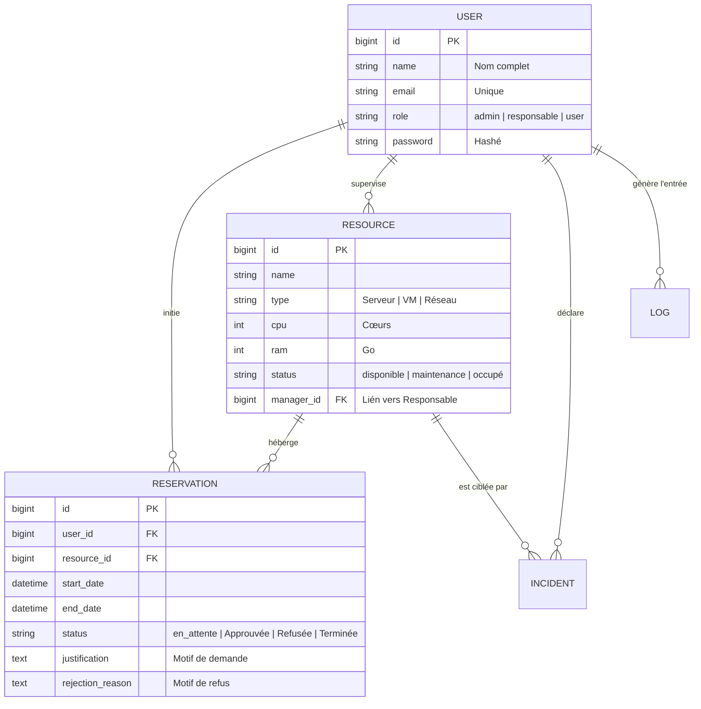

# Rapport Technique : Système de Gestion de Data Center (DC-Manager)

## 1. Introduction et Objectifs Pédagogiques
Le projet **DC-Manager** est une application Web de gestion de ressources informatiques (Data Center) réalisée dans l'optique de démontrer la maîtrise du cycle de développement complet d'une application professionnelle. 

### Objectifs principaux :
- **Architecture de haut niveau** : Mise en œuvre du framework Laravel selon les standards de l'industrie.
- **Maîtrise de l'UI/UX** : Conception d'une interface premium sans frameworks CSS tiers, garantissant une connaissance approfondie de la mise en page native.
- **Sécurité et Intégrité** : Gestion rigoureuse des accès et des transactions de données.

---

## 2. Architecture Logicielle et Choix Technologiques

### 2.1. Back-end : Le Framework Laravel 10
Le choix de Laravel repose sur sa capacité à gérer des logiques complexes via une syntaxe élégante.
- **Moteur Blade** : Utilisation de composants et de layouts hérités pour une maintenance facilitée.
- **Contrôleurs et Middlewares** : Séparation stricte entre la logique métier et la sécurité des accès.
- **Eloquent ORM** : Couche d'abstraction permettant des requêtes performantes et sécurisées.

### 2.2. Front-end : La Philosophie "Vanilla Core"
Contrairement aux approches modernes basées sur Tailwind ou Bootstrap, ce projet adopte une philosophie de **développement natif**.
- **Performance** : Réduction drastique du poids des pages par l'absence de bibliothèques superflues.
- **Interopérabilité** : Utilisation de **Vite.js** comme bundler moderne pour compiler les modules JavaScript et les pré-processeurs CSS, garantissant un chargement asynchrone et optimisé.

---

## 3. Conception et Modélisation (Bases de Données)

L'intégrité des données est le pilier du système. Nous avons opté pour un schéma relationnel normalisé.

### 3.1. Diagramme Entité-Relation (ERD)

### 3.2. Relations Métier
- **Relation 1:N (Un à Plusieurs)** : Un utilisateur peut générer plusieurs réservations, mais chaque réservation appartient à un seul utilisateur.
- **Gestion des Rôles** : Un système de rôles (`admin`, `responsable`, `user`) filtre dynamiquement les méthodes accessibles dans les contrôleurs.

---

## 4. Analyse Fonctionnelle Détaillée

### 4.1. Workflow de Réservation (Anti-Collision)
L'intelligence métier du projet réside dans sa capacité à détecter les chevauchements de dates. Avant chaque insertion, une requête vérifie si la ressource est déjà réservée sur la période demandée.

### 4.2. Système de Notifications & Monitoring
L'application intègre un système de notifications asynchrones :
- **Utilisateurs** : Alertés lors de l'approbation ou du refus d'une demande.
- **Responsables** : Notifiés instantanément de toute nouvelle demande sur leurs ressources.

### 4.3. Gestion des Incidents
Pour assurer la continuité de service, les utilisateurs peuvent déclarer des incidents. Cette fonctionnalité transforme la ressource ciblée en état critique, alertant immédiatement l'équipe technique.

---

## 5. Sécurité et Performances

### 5.1. Sécurité Applicative
Le projet implémente les protections de pointe :
- **Protection CSRF** : Protection contre les attaques par falsification de requête intersites.
- **Droit d'accès (ACL)** : Utilisation de Middlewares Laravel pour restreindre l'accès aux routes sensibles.
- **Audit Logging** : Chaque action critique (suppression, modification de ressource) est enregistrée dans une table de Logs pour analyse ultérieure.

### 5.2. Optimisation Front-end
- **CSS Variables** : Système de thème centralisé (Indigo & Dark Mode) permettant une modification globale du design en changeant quelques variables.
- **Vanilla JS** : Aucune dépendance jQuery. Les interactions sont gérées par des modules JavaScript modernes.

---

## 6. Guide d'Installation Professionnel
1. **Initialisation** : `composer install` & `npm install`.
2. **Environnement** : Configuration du fichier `.env` (MySQL).
3. **Persistance** : `php artisan migrate --seed`.
4. **Lancement** : `php artisan serve` & `npm run dev`.

---

## 7. Conclusion
Le projet **DC-Manager** n'est pas seulement un outil de gestion ; c'est une vitrine technologique prouvant qu'il est possible d'allier l'esthétique du Web moderne aux exigences de robustesse du génie logiciel classique. L'architecture est évolutive, prête à accueillir de futurs modules de monitoring réseau ou d'intégration d'API cloud.
