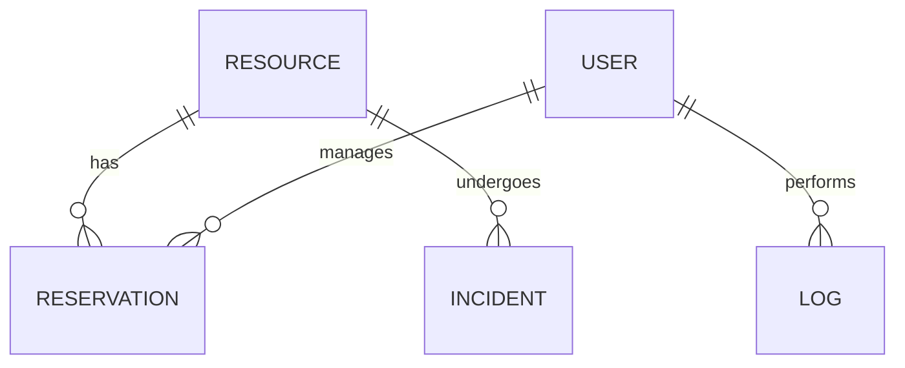

#  DC-Manager : Infrastructure & Resource Orchestrator

<div align="center">

[](https://laravel.com)
[](https://php.net)
[](https://mysql.com)
[](https://developer.mozilla.org/en-US/docs/Web/JavaScript)

**Une solution Enterprise-Grade pour la gestion, la réservation et le monitoring asynchrone des ressources de Data Center.**

[Concept](#-vision--concept) • [Spécifications](#-spécifications-techniques) • [Déploiement](#-guide-de-déploiement) • [Rapport PDF/MD](./RAPPORT_TECHNIQUE.md)

---

</div>

## 🎯 Vision & Concept

**DC-Manager** répond au défi critique de l'allocation des ressources informatiques (Serveurs Physiques, VMs, Baies de Stockage) dans un environnement multi-utilisateurs. 

Contrairement aux solutions génériques, ce projet repose sur un **moteur UI custom (Zero-Framework)**, offrant une expérience utilisateur fluide, un mode sombre immersif et une réactivité instantanée, tout en conservant la puissance du back-end Laravel.

---

## 🚀 Fonctionnalités Avancées

### 💎 Expérience Utilisateur (UI/UX)
- **Total Dark Mode** : Interface optimisée pour les administrateurs système (Indigo & Midnight Black).
- **Responsive Engine** : Adaptation parfaite sur mobile, tablette et desktop sans Bootstrap.
- **Real-time Feedback** : Notifications UI et badges de statut dynamiques.

### 🛡️ Core Logic & Sécurité
- **Algorithme d'Anti-Collision** : Vérification mathématique des chevauchements de dates de réservation.
- **ACL (Access Control List)** : 4 niveaux de privilèges (Invité, Ingénieur, Master Tech, Super Admin).
- **Audit Trail** : Journalisation exhaustive de chaque interaction système pour une traçabilité totale.
- **Incident Lifecycle** : Système de tickets intégré avec changement d'état automatique des ressources.

---

## 🛠 Spécifications Techniques

### Backend Architecture
- **Framework** : Laravel 10 (MVC Pattern)
- **ORM** : Eloquent avec relations polymorphiques et scopes de filtrage.
- **Validation** : Service de validation centralisé pour garantir l'intégrité métier.

### Frontend Architecture
- **Design System** : CSS Variables & Flexbox/Grid (Sans Tailwind/Bootstrap).
- **Asset Pipeline** : Vite.js avec Hot Module Replacement (HMR).
- **Icons** : FontAwesome 6 Pro integration.

---

## 📦 Guide de Déploiement

### Prérequis
- **PHP** : 8.1 minimum
- **Composer** : 2.x
- **Node.js** : 18.x + NPM
- **Serveur SQL** : MySQL 8.0+

### Installation Rapide

1. **Environnement PHP & JS**
   ```bash
   composer install
   npm install
   ```

2. **Configuration Système**
   ```bash
   cp .env.example .env
   php artisan key:generate
   ```
   *Note : Configurez vos identifiants `DB_DATABASE`, `DB_USERNAME` et `DB_PASSWORD` dans le `.env`.*

3. **Base de Données**
   ```bash
   php artisan migrate --seed
   ```

4. **Runtime**
   ```bash
   npm run build
   php artisan serve
   ```

---

## 📊 Visualisation du Schéma (ERD)



---

## 👥 Équipe de Développement (IDAI)

- **Dany Homam** — *Lead Developer & System Architect*
- **EL Hajioui Houssam** — *DevOps & Security Engineer*
- **El Bourmaki Salim** — *DBA & Core Backend*
- **Farssi Fatima Zahra** — *UI Specialist & QA*

---

<div align="center">

**Projet Académique d'Excellence — Université Abdelmalek Essaâdi**  
*Département Ingénierie De Développement D'Applications Informatiques*

</div>