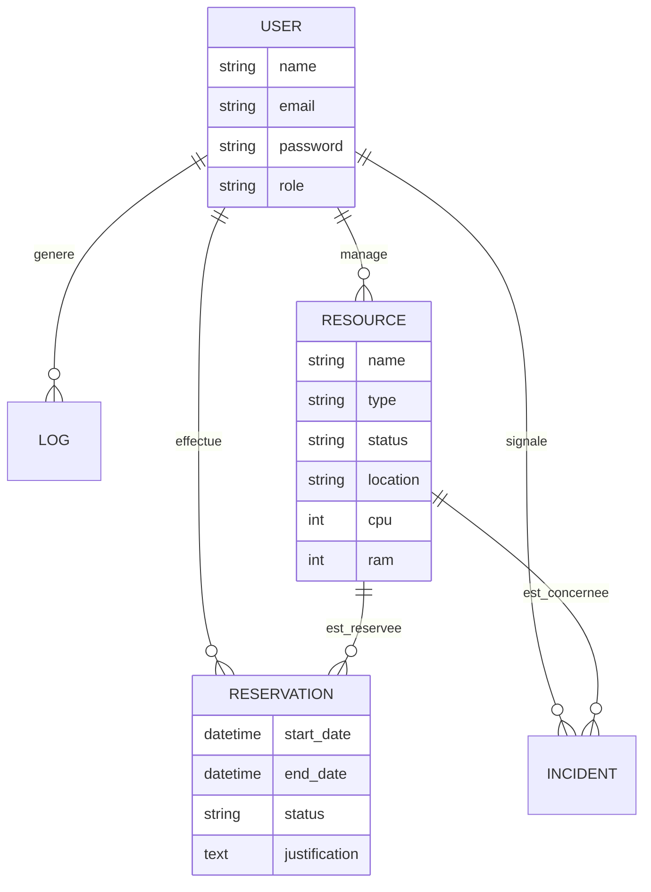
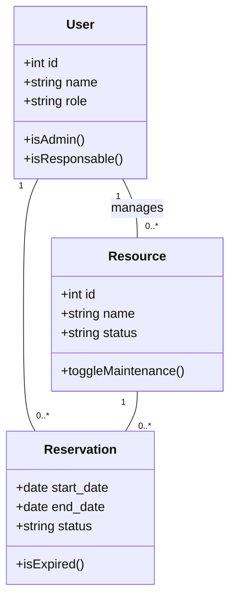

# Rapport Technique : DataHub
**Gestion de Ressources Data Center**

---

## 1. Introduction
### 1.1 Contexte du Projet
Le projet **DataHub** (anciennement DC-Manager) a été conçu pour répondre aux besoins critiques de gestion et de réservation des ressources au sein d'un Data Center. Dans un environnement où le matériel (serveurs, switches, routeurs) est partagé entre plusieurs ingénieurs, une traçabilité rigoureuse et une planification sans conflits sont indispensables pour garantir la continuité de service.

### 1.2 Objectif de l'Application
DataHub permet de :
- **Centraliser l'inventaire** du matériel.
- **Gérer les réservations** de manière interactive via un calendrier premium.
- **Suivre les incidents** signalés sur le parc.
- **Générer des rapports mensuels** pour l'administration.
- **Visualiser l'occupation** physique des baies (Rack Map).

---

## 2. Analyse Fonctionnelle
### 2.1 Acteurs du Système
- **Ingénieur (User)** : Consulte le catalogue, effectue des réservations, signale des incidents.
- **Responsable (Manager)** : Approuve les réservations, gère le matériel assigné.
- **Administrateur (Admin)** : Contrôle total sur les utilisateurs, le parc global et les journaux système (Logs).

### 2.2 Diagramme de Cas d'Utilisation (UML)
```mermaid
useCaseDiagram
    actor "Ingénieur" as Eng
    actor "Responsable" as Resp
    actor "Administrateur" as Admin

    Eng --> (Consulter Catalogue)
    Eng --> (Réserver Ressource)
    Eng --> (Signaler Incident)
    
    Resp --> (Gérer Inventaire)
    Resp --> (Valider Réservations)
    
    Admin --> (Gérer Utilisateurs)
    Admin --> (Générer Rapports)
    Admin --> (Consulter Logs)
    
    (Réserver Ressource) ..> (Vérifier Disponibilité) : <<include>>
```

---

## 3. Modélisation des Données
### 3.1 Modèle Conceptuel de Données (MCD)
Le schéma suivant représente les entités et leurs relations :



---

## 4. Architecture Technique
### 4.1 Pile Technologique (Stack)
- **Framework Backend** : Laravel (PHP 8.x)
- **Frontend** : Blade Templates, Vanilla CSS, JavaScript (Vite)
- **Base de Données** : MySQL / MariaDB
- **Notifications** : Système de notifications natif de Laravel (DB/Mail)

### 4.2 Diagramme de Classes (UML)


---

## 5. Description Étape par Étape des Modules

### Étape 1 : Authentification et Profilage
L'utilisateur accède à une interface de connexion sécurisée. Le système redirige l'utilisateur vers son tableau de bord spécifique selon son rôle (Engineer, Manager ou Admin).

### Étape 2 : Catalogue et Recherche Multi-facettes
Un système de filtrage avancé permet de trouver une ressource par type (Serveur, Switch, etc.) ou par état (Disponible, Maintenance, Bloqué).

### Étape 3 : Réservation Interactive (Calendrier Premium)
- Le système interroge une API AJAX pour récupérer les dates occupées.
- Le JavaScript bloque les clics sur les jours indisponibles (affichés en rouge).
- La réservation est soumise à validation par un responsable.

### Étape 4 : Workflow de Validation
Le responsable reçoit une notification en temps réel. Il peut soit **Approuver**, soit **Refuser** (avec obligation de fournir un motif). L'ingénieur est ensuite notifié de la décision.

### Étape 5 : Reporting et Maintenance
L'administrateur génère des rapports PDF détaillés incluant les statistiques du parc. Les ressources peuvent être mises en "Maintenance" ou "Bloquées" manuellement.

---

## 6. Bibliographie et Références
1. **Laravel Documentation** - [laravel.com](https://laravel.com/docs) : Référence principale pour l'architecture MVC et Eloquent ORM.
2. **Mermaid.js** - [mermaid.js.org](https://mermaid.js.org/) : Outil utilisé pour la génération des diagrammes UML et MCD.
3. **Vite Guide** - [vitejs.dev](https://vitejs.dev/) : Outil de build pour les assets Frontend.
4. **W3C CSS Standards** : Utilisation des variables CSS et Flexbox/Grid pour le design "DataHub".
5. **IDAI (Ingénierie du Développement d'Applications Informatiques)** : Normes de développement appliquées au projet.

---

*Ce document a été généré pour le projet DataHub (Homam_Projet) le 20 février 2026.*
