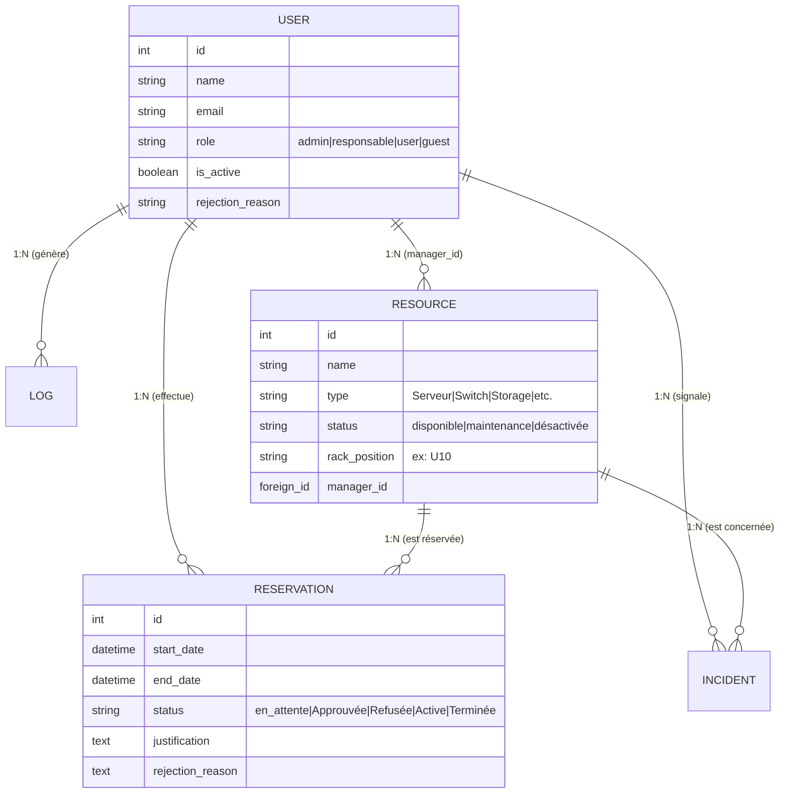
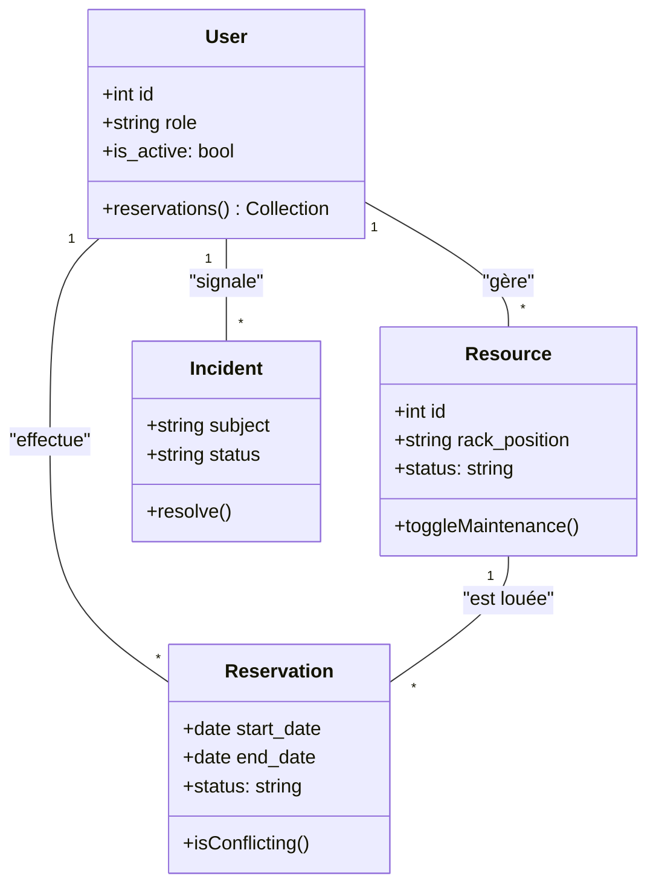
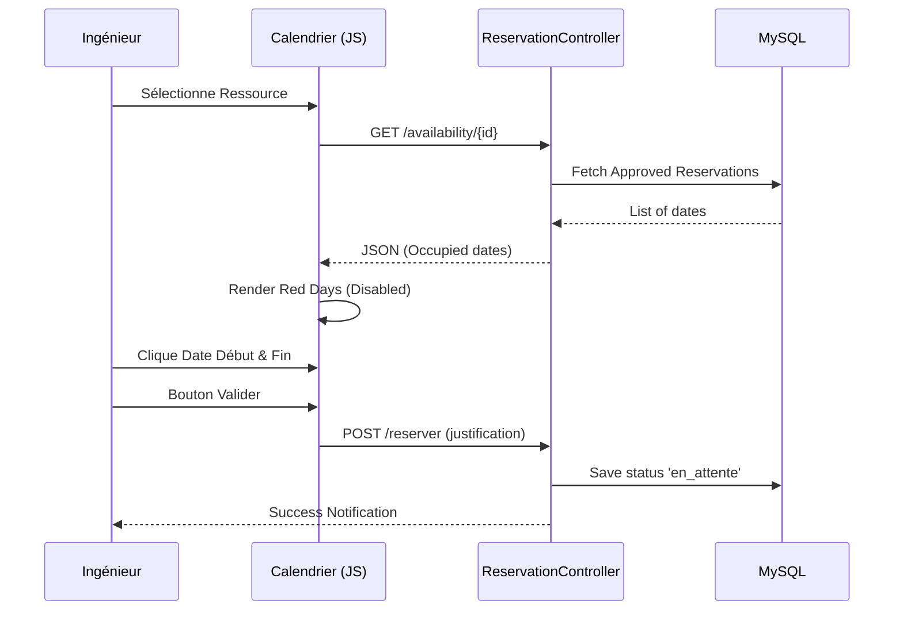

# Rapport Technique Ultra-Détaillé : DataHub
**Système de Gestion et de Réservation de Ressources Data Center**

---

## 1. Vision et Architecture Logicielle
### 1.1 Architecture MVC (Model-View-Controller)
L'application repose sur le pattern **MVC**, garantissant une séparation stricte des responsabilités :
- **Models** : Logique de données et relations Eloquent (`User`, `Resource`, `Reservation`, `Incident`, `Log`).
- **Views** : Interfaces dynamiques basées sur le moteur de template **Blade**.
- **Controllers** : Orchestration des requêtes, logique métier et sécurité.

### 1.2 Stack Technologique
- **Serveur** : XAMPP (Apache/PHP 8.2+).
- **Backend** : Laravel Framework.
- **Frontend** : CSS3 (Variables natives, Grid, Flexbox), JavaScript ES6 (Vanilla pour le calendrier), FontAwesome & Material Icons.
- **Build Tool** : Vite (Asset bundling et compilation JS/CSS).
- **Database** : MariaDB/MySQL.

---

## 2. Modélisation des Données (MCD)
Le Modèle Conceptuel de Données est structuré autour du cycle de vie d'une ressource.

### 2.1 Schéma et Cardinalités (Mermaid)

---

## 3. Analyse du Système par Rôles et Interactions

### 3.1 Rôle : Ingénieur (User)
L'ingénieur est l'utilisateur final qui consomme les ressources.

| Section | Boutons / Actions | Description du Détail |
| :--- | :--- | :--- |
| **Dashboard** | `Statistiques` | Visualisation graphique de l'occupation du parc via des barres de progression. |
| **Catalogue** | `Bouton Filtrer` | Tri instantané par type d'équipement ou par statut. |
| **Catalogue** | `Bouton Réserver` | Redirection vers l'interface de calendrier avec pré-sélection de la ressource. |
| **Calendrier** | `Sélection Dates` | Cliqueer sur une date de début et une de fin. Les dates déjà réservées s'affichent en **Rouge** et sont désactivées. |
| **Calendrier** | `Bouton Valider` | Envoie la demande au serveur avec la justification obligatoire. |
| **Mes Réservations** | `Bouton Supprimer`| Annulation d'une réservation en attente ou active. |
| **Incident** | `Bouton Signaler` | Formulaire pour décrire une panne sur une ressource spécifique. |

---

### 3.2 Rôle : Responsable (Manager)
Il supervise un parc d'équipements qui lui est assigné.

| Section | Boutons / Actions | Description du Détail |
| :--- | :--- | :--- |
| **Gestion Ressources** | `Bouton Éditer` | Modification des spécifications techniques (CPU, RAM, Rack). |
| **Gestion Ressources** | `Bouton Maintenance`| Bascule l'état vers "Maintenance" pour bloquer toute nouvelle réservation. |
| **Gestion Ressources** | `Bouton Bloquer` | Rend la ressource totalement invisible/inutilisable. |
| **Gestion Ressources** | `Bouton QR Code` | Génère une page d'impression avec le code QR unique de l'équipement. |
| **Validation** | `Badge Notification`| Affiche en temps réel le nombre de demandes en attente. |
| **Validation** | `Bouton Approuver` | Valide la réservation et notifie l'ingénieur par email/cloche. |
| **Validation** | `Bouton Refuser` | Ouvre une fenêtre modale pour saisir obligatoirement le motif du refus. |

---

### 3.3 Rôle : Administrateur (Admin)
L'admin assure la gouvernance globale.

| Section | Boutons / Actions | Description du Détail |
| :--- | :--- | :--- |
| **Dashboard Global** | `Graphes Stats` | Camemberts de répartition du matériel et histogrammes d'incidents. |
| **Gestion Users** | `Bouton Activer` | Approuve l'inscription d'un nouvel utilisateur (Guest -> User). |
| **Gestion Users** | `Bouton Rôle` | Permet de promouvoir un utilisateur en "Responsable" ou "Admin". |
| **Gestion Users** | `Bouton Supprimer`| Suppression définitive d'un compte avec confirmation. |
| **Logs Système** | `Filtres Logs` | Recherche par action (ex: "Suppression Compte") pour l'audit. |
| **Reporting** | `Bouton Rapport PDF`| Génère un rapport de 10+ pages incluant les KPIs de performance mensuelle. |

---

## 4. Diagrammes UML Avancés

### 4.1 Diagramme de Classes

### 4.2 Diagramme de Séquence : Flux de Réservation
Ce diagramme détaille l'interaction entre le Frontend, le Contrôleur et la Base de données.

---

## 5. Synthèse des Graphiques et Statistiques
- **Taux d'Occupation** : Calculé dynamiquement (Ressources réservées / Total ressources).
- **Répartition par Type** : Graphique circulaire montrant la part de chaque catégorie (Serveur, Virtualisation, Réseau).
- **Statistiques d'Incidents** : Suivi du délai moyen de résolution et du volume d'alertes ouvertes vs résolues.

---

## 6. Bibliographie et Sources
### 6.1 Documentation Technique
- **Laravel 10 Framework Guide** : Base de l'architecture MVC, Middleware et Eloquent. [laravel.com](https://laravel.com)
- **MDN Web Docs** : Sources pour l'implémentation du JavaScript Vanilla et des API fetch.
- **FontAwesome & Lucide Icons** : Bibliothèques d'icônes pour l'interface utilisateur.

### 6.2 Outils de Visualisation
- **Chart.js** : Utilisé pour la génération des graphiques du dashboard admin.
- **Mermaid.js** : Moteur de rendu pour les diagrammes UML et MCD intégrés.
- **DomPDF** : Moteur PHP utilisé pour la transformation du HTML/CSS en rapports PDF professionnels.

### 6.3 Normes de Développement
- **IDAI ID standards** : Respect des conventions de nommage et de structure de données définies pour le diplôme.

---

*Ce rapport technique ultra-détaillé a été finalisé le 20 février 2026 pour le projet DataHub.*
